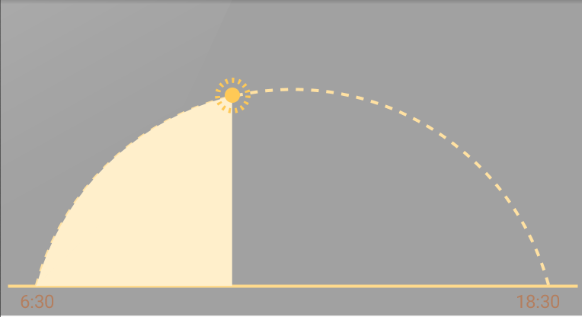

# WeatherView
WeatherView

## 使用示例
```xml
<com.cm.weatherview.WeatherView
        android:layout_width="match_parent"
        android:layout_height="wrap_content"
        android:background="#a1a1a1"
        app:arcOffsetAngle="15"
        app:currentTime="11:30"
        android:padding="5dp"/>
```

## 效果


## 自定义属性
res/values/attr.xml WeatherViewStyle
```xml
<declare-styleable name="WeatherViewStyle">
        <!--开始时间-->
        <attr name="startTime"  format="string|reference"/>
        
        <!--结束时间-->
        <attr name="endTime"  format="string|reference"/>
        
        <!--当前时间-->
        <attr name="currentTime"  format="string|reference"/>
        
        <!--时间文字大小-->
        <attr name="timeTextSize" format="dimension|reference"/>
        
        <!--时间文字颜色-->
        <attr name="timeTextColor" format="color|reference"/>
        
        <!--圆弧上显示的天气图标-->
        <attr name="weatherDrawable" format="reference"/>
        
        <!--底部线条颜色-->
        <attr name="bottomLineColor" format="color|reference"/>
        
        <!--底部线条高度-->
        <attr name="bottomLineHeight" format="dimension|reference"/>
        
        <!--圆弧虚线颜色-->
        <attr name="arcColor" format="color|reference"/>
        
        <!--圆弧虚线宽度-->
        <attr name="arcDashWidth" format="dimension|reference"/>
        
        <!--圆弧虚线空隙宽度-->
        <attr name="arcDashGapWidth" format="dimension|reference"/>
        
        <!--圆弧虚线厚度-->
        <attr name="arcDashHeight" format="dimension|reference"/>
        
        <!--圆弧填充颜色-->
        <attr name="arcSolidColor" format="color|reference"/>
        
        <!--圆弧半径-->
        <attr name="arcRadius" format="dimension|reference"/>

        <!--圆弧下移角度-->
        <attr name="arcOffsetAngle" format="integer|reference"/>

        <!--太阳的颜色-->
        <attr name="sunColor" format="color|reference"/>

        <!--文字离图形的距离-->
        <attr name="textPadding" format="dimension|reference"/>
    </declare-styleable>
```